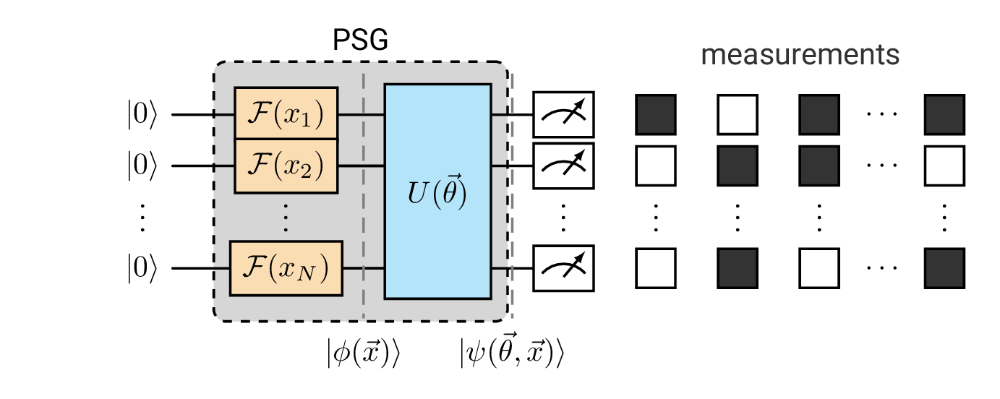

# squantikz - Saverio's quantikz

LaTeX package for my modular TikZ/Quantikz figures.  
Provides shared colors, styles, helper macros, and a simple interface `\squimport` to include figures from a central `tikz/` folder with customizable color schemes.

---

## Installation (Ubuntu / Linux)

1. Create a local TeX tree if it doesn’t already exist:

```bash
mkdir -p ~/texmf/tex/latex/
```

2. Move the entire `squantikz` folder into your local tree:

```bash
mv squantikz ~/texmf/tex/latex/
```

3. Update TeX’s filename database (optional, but recommended):

```bash
texhash ~/texmf
```

## Usage
The package provides a single macro:

```latex
\squimport[<options>]{<figure-name>}
```
* Arguments:
    * `<figure-name>` = filename of a figure inside the tikz/ folder (without .tex).
    * `<options>` = optional key–value arguments to override default colors.

* Default colors:
    * main: desyblue (#00A6EB)
    * secondary: desyorange ( #F28E00)
    * tertiary: desygray (#777777)

* Options
    * main=`<color>` → sets the primary color
    * secondary=`<color>` → sets the secondary color
    * tertiary=`<color>` → sets the tertiary color

## Examples

```latex
\squimport{psg_model}
```


```latex
\definecolor{myviolet}{RGB}{150,0,255}
\squimport[main=myviolet]{qag_train}
```


```latex
\definecolor{myviolet}{RGB}{150,0,255}
\definecolor{myblue}{RGB}{50,200,255}
\definecolor{mygreen}{RGB}{50,250,0}
\squimport[main=myviolet, secondary=myblue, tertiary=mygreen]{qag_model}
```
